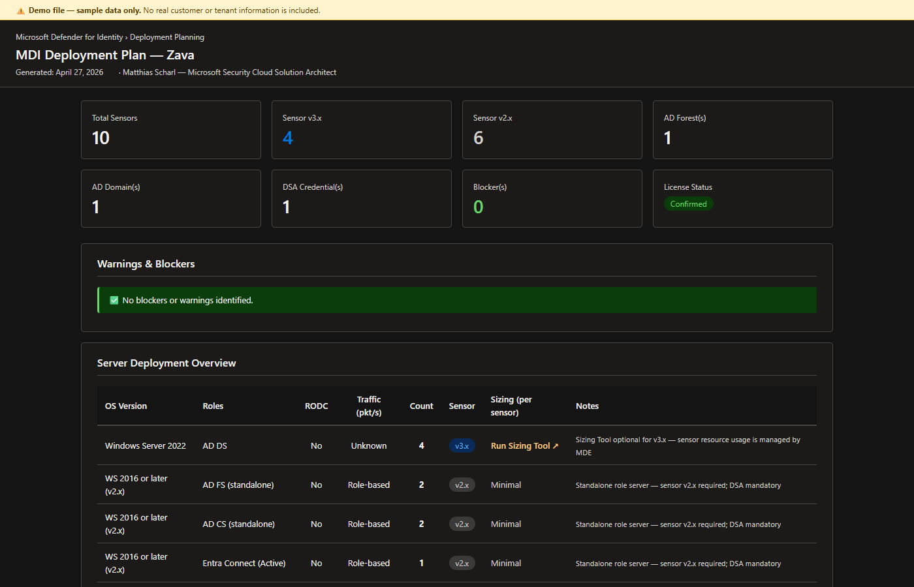

# MDI Deployment Planner

Interactive PowerShell tool that guides security professionals through a structured questionnaire about a customer's environment and generates a tailored Microsoft Defender for Identity deployment plan.

---

**Author:** Matthias Scharl — Security Cloud Solution Architect at Microsoft

**Contributors:**
- Konstantin Klein — Security Cloud Solution Architect at Microsoft
- Robert Stampfer — Security Cloud Solution Architect at Microsoft

---

> **AI Transparency Notice**
> This solution was created with the assistance of **GitHub Copilot**. All AI-generated output has been reviewed by the author. Independent review by the customer is recommended before use in production.
> Learn more: [Microsoft Responsible AI](https://www.microsoft.com/en-us/ai/responsible-ai)

---

## Overview



Deploying Microsoft Defender for Identity requires careful planning across multiple dimensions — sensor version selection (v2.x vs v3.x), hardware sizing, network connectivity, Active Directory service accounts, Windows event auditing, and phased sensor rollout. Without a structured approach, organizations risk deploying the wrong sensor version, missing critical audit policies, or encountering connectivity blockers mid-deployment.

This tool solves that by:

- Walking through a structured 10-section questionnaire (fully offline, no AD connection required)
- Auto-recommending the correct sensor version per DC group based on OS, MDE status, and feature requirements
- Estimating sensor CPU/RAM requirements from the official MDI sizing table
- Calculating required Directory Service Account (DSA) credentials for single and multi-forest environments
- Recommending the appropriate Windows event auditing approach (Automatic — Defender portal toggle, sensor self-maintains policies — vs PowerShell `Set-MDIConfiguration` cmdlets)
- Generating a phased, actionable deployment checklist with direct links to Microsoft Learn documentation
- Flagging blockers and warnings (unlicensed, SSL inspection, legacy OS, unknown sizing, ATA coexistence, etc.)
- Pre-populating all `Set-MDIConfiguration` cmdlets with `-WhatIf` and including safety banners so engineers must consciously review before applying changes
- Producing a self-contained HTML report with Export to PDF for customer handoff

```
CSA runs script on management workstation
        │
        ▼
 ┌──────────────────────────────────────────┐
 │  1. Licensing confirmation               │
 │  2. ATA migration check                  │
 │  3. Forest & domain topology             │
 │  4. DC inventory (groups, OS, traffic)   │
 │  5. Standalone role servers              │
 │  6. Connectivity method                  │
 │  7. MDE deployment status                │
 │  8. Feature requirements                 │
 │  9. DSA type preference                  │
 │ 10. Identity & PAM integrations          │
 └──────────────────────────────────────────┘
        │
        ▼
   Logic Engine
  (sensor version · sizing · DSA count · auditing approach · checklist)
        │
        ├──► Report/MDIDeploymentPlan-<CustomerName>-<timestamp>.json
        ├──► Report/MDIDeploymentPlan-<CustomerName>-<timestamp>.html  (open in browser)
        └──► Report/MDIDeploymentPlan-<CustomerName>-<timestamp>.pdf   (optional, via Edge CDP)
```

---

## Security Notes

- **Zero Trust / Least Privilege** — this tool performs no write operations and requires no elevated permissions. It runs entirely offline.
- **No stored credentials** — no passwords, tokens, or subscription IDs are collected or stored. The DSA password is never requested.
- **No PII** — server names are not collected. The questionnaire uses group-based input only.
- **No external connections** — the script does not connect to Active Directory, Azure, Microsoft Graph, or any external service.
- **HTML report security** — the generated HTML loads Bootstrap 5 from CDN (jsDelivr). No customer data is transmitted.

---

## Prerequisites

| Requirement | Details |
|---|---|
| PowerShell | 7.2 or later |
| Permissions | None — fully offline, no AD or Azure connection required |
| Internet (HTML report) | Bootstrap 5 CDN required to render the HTML report in a browser |
| MDI license (customer) | EMS E5/A5 · Microsoft 365 E5/A5/G5 · M365 E5/F5 Security · M365 F5 Security + Compliance · Standalone MDI license |
| Microsoft Edge (PDF, optional) | Pre-installed on Windows 10/11. PDF generation uses Edge's Chrome DevTools Protocol — no additional software required. |

---

## Workflow

1. Open a PowerShell 7.2+ terminal on the CSA workstation
2. Navigate to the `MDI Deployment Planner` folder
3. Run the script (with or without parameters)
   - With `-CustomerName`: starts a new plan immediately
   - Without `-CustomerName`: shows a menu — **New plan**, **Resume draft**, or **Load existing plan**
4. Answer the 10 questionnaire sections interactively (draft is auto-saved after each section)
5. On the Review screen, verify all sections are green — yellow ⚠ indicators mark anything unanswered
6. Press `[G]` to generate the report (validation runs before building)
7. Optionally generate a PDF report (prompted automatically; requires Microsoft Edge — pre-installed on Windows 10/11)
8. Open the generated HTML (and PDF) report in the browser

```powershell
# Basic run — prompts for customer name interactively
.\Invoke-MDIDeploymentPlanner.ps1

# Specify customer name and open report automatically
.\Invoke-MDIDeploymentPlanner.ps1 -CustomerName 'Zava' -OpenInBrowser

# Save output to a specific directory
.\Invoke-MDIDeploymentPlanner.ps1 -CustomerName 'Zava' -OutputPath 'C:\Reports' -OpenInBrowser
```

---

## Scripts

### `Invoke-MDIDeploymentPlanner.ps1`

Interactive MDI Deployment Planning tool. Collects environment data through a structured CLI questionnaire and generates a deployment plan in JSON and HTML format.

**Questionnaire UX features:**
- Single-keypress answers — no Enter key required for Yes/No or multiple-choice prompts (≤ 9 options)
- Progress bar `[████░░░░] N / 10` and answers-so-far summary box printed at the top of each section
- **Draft auto-save** — answers are saved to `Report/MDIDeploymentPlan-<CustomerName>-DRAFT.json` after every section. If the script is interrupted, re-running without `-CustomerName` will offer to resume from the draft.
- Review screen after all 10 sections — shows all answers and allows jumping back to any section (`[1]`–`[9]` or `[0]` for section 10) before generating the report
  - Unanswered sections are highlighted in **yellow** with a ⚠ indicator so nothing is missed
  - Pressing `[G]` validates all mandatory sections before building the report; any incomplete sections are listed and a keypress pause keeps the error on screen
- DC group live preview table after each group — shows OS, count, v2/v3 sensor preview, and co-hosted roles
- 3-way DC group navigation: `[Y]` add another · `[N]` done · `[E]` edit last group
- **Load or resume existing plan** — running the script without `-CustomerName` presents a menu: start a new plan, resume from a saved draft, or re-open any previously exported `MDIDeploymentPlan-*.json` file for review and re-export

**Parameters:**

| Parameter | Type | Required | Description |
|---|---|---|---|
| `-CustomerName` | String | No | Customer or organisation name for the report title. Prompted interactively if omitted — the startup menu also allows loading an existing plan or resuming an in-progress draft. |
| `-OutputPath` | String | No | Directory for output files. Defaults to the script's own directory. |
| `-OpenInBrowser` | Switch | No | Opens the HTML report in the default browser immediately after generation. |
| `-Plan` | String | No | Path to an existing `MDIDeploymentPlan-*.json` file. Skips the questionnaire entirely and re-generates the report from the saved answers. Useful for re-export, automation, or updating a plan after minor edits. |
| `-NoPdf` | Switch | No | Suppresses the "Generate PDF?" and "Open in browser?" prompts. Use together with `-Plan` for fully non-interactive re-export. |

**Example — minimal:**
```powershell
.\Invoke-MDIDeploymentPlanner.ps1
```

**Example — full:**
```powershell
.\Invoke-MDIDeploymentPlanner.ps1 -CustomerName 'Zava' -OutputPath 'C:\Reports' -OpenInBrowser
```

**Example — re-generate existing plan (non-interactive):**
```powershell
.\Invoke-MDIDeploymentPlanner.ps1 -Plan '.\Report\MDIDeploymentPlan-Zava-20260526-120000.json' -NoPdf
```

**Outputs:**

| File | Description |
|---|---|
| `Report/MDIDeploymentPlan-<CustomerName>-<timestamp>.json` | Raw answers + derived recommendations + full checklist array |
| `Report/MDIDeploymentPlan-<CustomerName>-<timestamp>.html` | Self-contained HTML report — summary cards, server table, DSA guide, connectivity config, auditing approach, phased checklist with `-WhatIf` cmdlines and docs links, warnings, references |
| `Report/MDIDeploymentPlan-<CustomerName>-<timestamp>.pdf` | Print-ready PDF generated via Edge CDP (prompted at runtime; requires Microsoft Edge — pre-installed on Windows 10/11) |

---

## Questionnaire Sections

| # | Section | Key Questions |
|---|---|---|
| 1 | Licensing | License confirmed? Which license type? |
| 2 | ATA Migration | Is Microsoft ATA present? Is it still active and in use? |
| 3 | Forest & Domain Topology | Number of forests, domains, trust types between forests |
| 4 | DC Inventory | DC groups: OS version, co-hosted roles, RODC flag, traffic range, count |
| 5 | Standalone Role Servers | Standalone AD FS / AD CS / Entra Connect server counts |
| 6 | Connectivity | Direct / Proxy / ExpressRoute / Firewall; proxy URL; SSL inspection flag |
| 7 | MDE Deployment | MDE on all DCs / some / none (gates v3.x eligibility) |
| 8 | Feature Requirements | VPN integration, syslog notifications (both force v2.x) |
| 9 | DSA Preference | gMSA (recommended) vs regular AD user |
| 10 | Identity & PAM Integrations | Okta SSO, CyberArk Identity (Preview), SailPoint ISC (Preview), PAM service vendor (CyberArk PAM / BeyondTrust / Delinea / Other) |

---

## Sensor Version Logic

| Condition | Result |
|---|---|
| DC on WS 2019 / 2022 / 2025 with MDE deployed AND no VPN/syslog requirement | **v3.x recommended** |
| DC on WS 2016 or Other/Legacy | **v2.x** |
| DC with MDE not deployed | **v2.x** |
| VPN integration required | **v2.x** (all DCs) |
| Syslog notifications required | **v2.x** (all DCs) |
| Standalone AD FS / AD CS / Entra Connect | **v2.x** (always) |

---

## PowerShell Safety Design

All `Set-MDIConfiguration` cmdlets in the generated checklist are pre-populated with `-WhatIf`. The HTML report displays a **red danger banner** at the top of Phase 1 and Phase 4 that explicitly instructs engineers to:

1. Run the `-WhatIf` version first and review every line of output
2. Understand exactly what will be changed (GPOs created and linked, or system configuration modified)
3. Obtain change-management approval before removing `-WhatIf` and applying changes

`AdvancedAuditPolicyCAs` and `EntraConnectAuditing` also include `-SkipGpoLink` with instructions to manually link the GPO to the Issuing CA / Entra Connect OU only, preventing accidental domain-wide application.

---

## References

- [What is Microsoft Defender for Identity?](https://learn.microsoft.com/en-us/defender-for-identity/what-is)
- [MDI Deployment Overview](https://learn.microsoft.com/en-us/defender-for-identity/deploy/deploy-defender-identity)
- [Sensor v2.x Prerequisites](https://learn.microsoft.com/en-us/defender-for-identity/deploy/prerequisites-sensor-version-2)
- [Sensor v3.x Prerequisites](https://learn.microsoft.com/en-us/defender-for-identity/deploy/prerequisites-sensor-version-3)
- [Capacity Planning](https://learn.microsoft.com/en-us/defender-for-identity/deploy/capacity-planning)
- [MDI Sizing Tool](https://aka.ms/mdi/sizingtool)
- [Configure gMSA Directory Service Account](https://learn.microsoft.com/en-us/defender-for-identity/deploy/create-directory-service-account-gmsa)
- [Windows Event Auditing](https://learn.microsoft.com/en-us/defender-for-identity/deploy/configure-windows-event-collection)
- [Proxy / Connectivity Configuration](https://learn.microsoft.com/en-us/defender-for-identity/deploy/configure-proxy)
- [Install Sensor v2.x](https://learn.microsoft.com/en-us/defender-for-identity/deploy/install-sensor)
- [Migrate from ATA to Microsoft Defender for Identity](https://learn.microsoft.com/en-us/defender-for-identity/migrate-from-ata-overview)
- [Activate Sensor v3.x](https://learn.microsoft.com/en-us/defender-for-identity/deploy/activate-sensor)
- [AD FS / AD CS / Entra Connect Sensors](https://learn.microsoft.com/en-us/defender-for-identity/deploy/active-directory-federation-services)
- [Multi-Forest Considerations](https://learn.microsoft.com/en-us/defender-for-identity/deploy/multi-forest)
- [Test-MdiReadiness Script (GitHub)](https://github.com/microsoft/Microsoft-Defender-for-Identity/tree/main/Test-MdiReadiness)
- [DefenderForIdentity PowerShell Module](https://www.powershellgallery.com/packages/DefenderForIdentity/)
- [Set-MDIConfiguration cmdlet reference](https://learn.microsoft.com/en-us/powershell/module/defenderforidentity/set-mdiconfiguration?view=defenderforidentity-latest)

---

## Disclaimer

This script is provided **AS IS** without warranty of any kind. The author and Microsoft assume no liability for any damages arising from its use. The customer is solely responsible for reviewing, testing, and validating the generated plan before executing any deployment steps in their environment.
