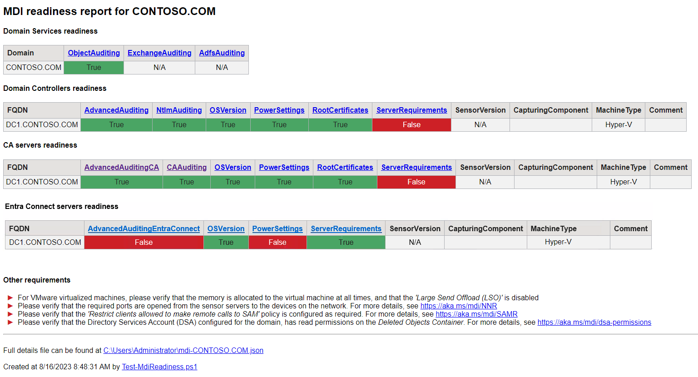

# Test-MdiReadiness.ps1

The Test-MdiReadiness.ps1 script will query your domain, domain controllers and CA servers to report if the different **Microsoft Defender for Identity** prerequisites are in place or not. It creates an html report and a detailed json file with all the collected data.

It will check the domain for the following items:

- [Object Auditing](https://aka.ms/mdi/objectauditing)
- [Exchange Auditing](https://aka.ms/mdi/exchangeauditing)
- [ADFS Auditing](https://aka.ms/mdi/adfsauditing)

It will test the domain controllers for the following items:

- [Advanced Audit Policy Configuration](https://aka.ms/mdi/advancedauditing)
- [NTLM Auditing](https://aka.ms/mdi/ntlmauditing)
- [Power scheme is set to *high performance*](https://aka.ms/mdi/powersettings)
- [Root certificates are updated](https://aka.ms/mdi/rootcertificates)

It will test the CA servers for the following items:

- [Advanced Audit Policy Configuration for CA servers](https://aka.ms/mdi/advancedauditingca)
- [CA Auditing](https://aka.ms/mdi/caauditing)
- [Power scheme is set to *high performance*](https://aka.ms/mdi/powersettings)
- [Root certificates are updated](https://aka.ms/mdi/rootcertificates)



```txt
NAME
    .\Test-MdiReadiness.ps1

SYNOPSIS
    Verifies Microsoft Defender for Identity prerequisites are in place

DESCRIPTION
    This script will query your domain and report if the different Microsoft Defender for Identity prerequisites are in place. It creates an html report and a detailed json file with all the collected data.

SYNTAX
    .\Test-MdiReadiness.ps1 [[-Path] <String>] [[-Domain] <String>] [[-DomainController] <String[]>] [[-CAServer] <String[]>] [-OpenHtmlReport] [-WhatIf] [-Confirm] [<CommonParameters>]

    .\Test-MdiReadiness.ps1 [[-Path] <String>] [[-Domain] <String>] [[-DomainController] <String[]>] [-SkipCA] [-OpenHtmlReport] [-WhatIf] [-Confirm] [<CommonParameters>]

PARAMETERS
    -Path <String>
        Path to a folder where the reports are be saved. Defaults to the current folder.

        Required?                    false
        Position?                    1
        Default value                .
        Accept pipeline input?       false
        Accept wildcard characters?  false

    -Domain <String>
        Domain Name or FQDN to work against. Defaults to the current domain.

        Required?                    false
        Position?                    2
        Default value
        Accept pipeline input?       false
        Accept wildcard characters?  false

    -DomainController <String[]>
        Specific Domain Controller(s) to work against. If not specified, it will query AD for the list of DCs in the domain.

        Required?                    false
        Position?                    3
        Default value
        Accept pipeline input?       false
        Accept wildcard characters?  false

    -CAServer <String[]>
        Specific Certificate Authority server(s) to work against. If not specified, it will query AD for the members of the "Cert Publishers" group.

        Required?                    false
        Position?                    4
        Default value
        Accept pipeline input?       false
        Accept wildcard characters?  false

    -SkipCA [<SwitchParameter>]
        Skip Certificate Authority servers

        Required?                    false
        Position?                    named
        Default value                False
        Accept pipeline input?       false
        Accept wildcard characters?  false

    -OpenHtmlReport [<SwitchParameter>]
        Open the HTML report at the end of the collection process

        Required?                    false
        Position?                    named
        Default value                False
        Accept pipeline input?       false
        Accept wildcard characters?  false

NOTES

        Copyright (c) Microsoft Corporation.  All rights reserved.
        Use of this sample source code is subject to the terms of the Microsoft
        license agreement under which you licensed this sample source code. If
        you did not accept the terms of the license agreement, you are not
        authorized to use this sample source code.
        THE SAMPLE SOURCE CODE IS PROVIDED "AS IS", WITH NO WARRANTIES.

    -------------------------- EXAMPLE 1 --------------------------

    PS C:\>.\Test-MdiReadiness.ps1 -DomainController DC1 -OpenHtmlReport
    False

    -------------------------- EXAMPLE 2 --------------------------

    PS C:\>.\Test-MdiReadiness.ps1 -Verbose
    VERBOSE: Performing the operation "Create MDI related configuration reports" on target "CONTOSO.COM".
    VERBOSE: Searching for Domain Controllers in CONTOSO.COM
    VERBOSE: Found 2 Domain Controller(s)
    VERBOSE: Testing server requirements for DC1.CONTOSO.COM
    VERBOSE: Testing power settings for DC1.CONTOSO.COM
    VERBOSE: Testing advanced auditing for DC1.CONTOSO.COM
    VERBOSE: Testing NTLM auditing for DC1.CONTOSO.COM
    VERBOSE: Testing certificates readiness for DC1.CONTOSO.COM
    VERBOSE: Testing MDI sensor for DC1.CONTOSO.COM
    VERBOSE: Testing capturing component for DC1.CONTOSO.COM
    VERBOSE: Getting virtualization platform for DC1.CONTOSO.COM
    VERBOSE: Getting Operating System for DC1.CONTOSO.COM
    VERBOSE: Testing server requirements for DC2.CONTOSO.COM
    VERBOSE: Testing power settings for DC2.CONTOSO.COM
    VERBOSE: Testing advanced auditing for DC2.CONTOSO.COM
    VERBOSE: Testing NTLM auditing for DC2.CONTOSO.COM
    VERBOSE: Testing certificates readiness for DC2.CONTOSO.COM
    VERBOSE: Testing MDI sensor for DC2.CONTOSO.COM
    VERBOSE: Testing capturing component for DC2.CONTOSO.COM
    VERBOSE: Getting virtualization platform for DC2.CONTOSO.COM
    VERBOSE: Getting Operating System for DC2CONTOSO.COM
    VERBOSE: Searching for CA servers in CONTOSO.COM
    VERBOSE: Found 2 CA server(s)
    VERBOSE: Testing server requirements for CA1.CONTOSO.COM
    VERBOSE: Testing power settings for CA1.CONTOSO.COM
    VERBOSE: Testing advanced auditing for CA1.CONTOSO.COM
    VERBOSE: Testing CA auditing for CA1.CONTOSO.COM
    VERBOSE: Testing certificates readiness for CA1.CONTOSO.COM
    VERBOSE: Testing MDI sensor for CA1.CONTOSO.COM
    VERBOSE: Testing capturing component for CA1.CONTOSO.COM
    VERBOSE: Getting virtualization platform for CA1.CONTOSO.COM
    VERBOSE: Getting Operating System for CA1.CONTOSO.COM
    VERBOSE: Testing server requirements for CA2.CONTOSO.COM
    VERBOSE: Testing power settings for CA2.CONTOSO.COM
    VERBOSE: Testing advanced auditing for CA2.CONTOSO.COM
    VERBOSE: Testing CA auditing for CA2.CONTOSO.COM
    VERBOSE: Testing certificates readiness for CA2.CONTOSO.COM
    VERBOSE: Testing MDI sensor for CA2.CONTOSO.COM
    VERBOSE: Testing capturing component for CA2.CONTOSO.COM
    VERBOSE: Getting virtualization platform for CA2.CONTOSO.COM
    VERBOSE: Getting Operating System for CA2.CONTOSO.COM
    VERBOSE: Getting MDI related ADFS auditing configuration
    VERBOSE: Getting MDI related DS Object auditing configuration
    VERBOSE: Getting MDI related Exchange auditing configuration
    VERBOSE: Getting AD Schema Version
    VERBOSE: Creating detailed json report: .\mdi-CONTOSO.COM.json
    VERBOSE: Creating html report: .\mdi-CONTOSO.COM.html
    False
```
